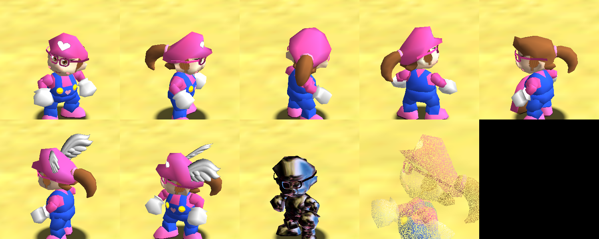

# Haylie's World 64 — v1 character build

Haylie replaces Mario as the playable character in a HackerSM64 2.4.0 build. She keeps Mario's skeleton, animations and gameplay exactly as they were.



## Build it (Linux or GitHub Codespaces)
```bash
./build_haylie64.sh "/path/to/Super Mario 64 (USA).zip"   # .z64 also works
# -> out/Haylies_World_64.z64
```
The script:
1. Installs the toolchain.
2. Clones HackerSM64 and pins it to `8953c07`.
3. Checks that the ROM's SHA-1 is `9bef1128717f958171a4afac3ed78ee2bb4e86ce`.
4. Extracts assets and runs `tools/apply_haylie.py`.
5. Runs `make`.

Your ROM is only read and is never changed. ROMs and build output are git-ignored, so they never get committed.

Verified output: `Haylies_World_64.z64`, SHA-1 `43d97c92937919d978e2bfc79629379a22e4e55f`. The build is reproducible: two clean builds gave the same hash. Full log: [BUILD_LOG.txt](BUILD_LOG.txt) (0 errors, 0 warnings).

## What changed (all in `tools/apply_haylie.py`)
| Area | Change |
|---|---|
| Palette | Pink cap/shirt/sleeves, pink shoes, royal-blue overalls, fair skin, brown hair. Applied to every LOD and to the loose cap actor. |
| Head shape | Mario's nose shrunk to a button nose and the heavy jaw slimmed. The same transform is applied to all head meshes, so no seams open. |
| Face | Moustache removed. Added a 3D open smile with tongue, blush cheeks, and new big brown eyes with lashes (open, half-closed and closed, so blinking works). Sideburns became brown hair locks. |
| New geometry | Rounded pink glasses with temples, a brown ponytail and a pink scrunchie, attached to the head bone. They appear on cap-on, cap-off, low-poly, Wing, Metal and Vanish heads. Pink heart on the overalls bib. |
| Cap | White heart logo on the worn cap, the held cap and the dropped cap. |
| HUD | Lives icon is now a Haylie head. |

`patch/hackersm64_v1.diff` is the resulting source diff against HackerSM64.

## Fixes to the v0.1 bootstrap
The original package is kept in `bootstrap_v0.1_original/`. It had three problems:
- Its texture edits wrote to `*.inc.c` files. HackerSM64 extracts these textures as PNGs, so the cap logo and moustache never changed.
- Its glasses were a flat horizontal ring at the cap-brim level, and its ponytail pointed down into the torso. The head bone uses **X = up, Y = forward, Z = sideways**.
- It recolored only the high-poly shoes and skipped the dropped-cap actor.

## Preview tooling (dev only, never in the release ROM)
- `tools/apply_preview.py 1|2` makes a test copy of the build. It boots straight into Castle Grounds and either spins Haylie on a turntable while cycling cap states (`1`) or drives scripted controller input: run, jump, triple jump, crouch, punch (`2`). Screenshots come from `mupen64plus --testshots`.
- `tools/render_head.py` renders the head display lists offline, for fast iteration.
